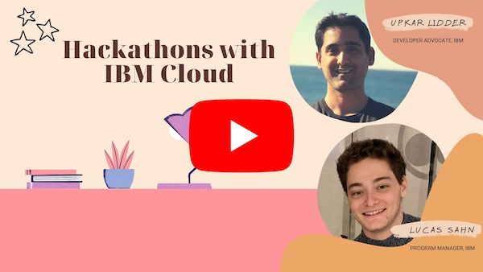
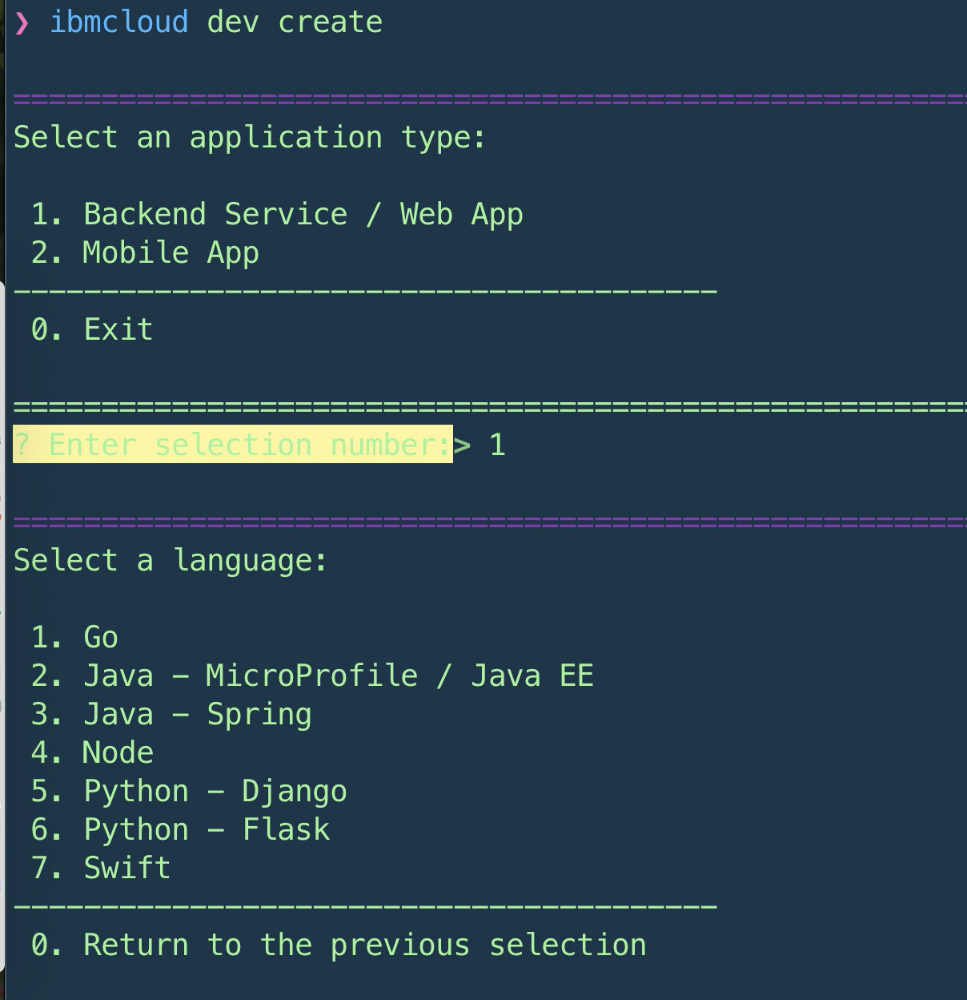

# Build Fast on IBM Cloud

## Collection of tips and tutorials to help you get started quickly with IBM Cloud. 

Click on the picture below to watch a short video on how you can build and host amazing projects on IBM Cloud!

- [Build Fast on IBM Cloud](#build-fast-on-ibm-cloud)
  - [What is IBM Cloud?](#what-is-ibm-cloud)
  - [How do I sign up?](#how-do-i-sign-up)
  - [Is it free?](#is-it-free)
  - [What are some  products I can use to get started quickly?](#what-are-some--products-i-can-use-to-get-started-quickly)
    - [IBM Cloud Essentials Course](#ibm-cloud-essentials-course)
    - [IBM Developer resources](#ibm-developer-resources)
    - [Machine Learning](#machine-learning)
      - [Natural Language Understanding](#natural-language-understanding)
      - [Watson Assistant](#watson-assistant)
      - [Visual Recognition - Cloud Annotation Tool](#visual-recognition---cloud-annotation-tool)
      - [Jupyter Notebooks](#jupyter-notebooks)
      - [Watson Machine Learning](#watson-machine-learning)
      - [AutoAI](#autoai)
    - [Databases](#databases)
      - [Relational Database - DB2](#relational-database---db2)
      - [NoSQL Database - Cloudant](#nosql-database---cloudant)
    - [Application Runtimes](#application-runtimes)
    - [Rapid Prototyping](#rapid-prototyping)
  - [Climate Change resources](#climate-change-resources)
  - [Build fast with IBM Cloud videos](#build-fast-with-ibm-cloud-videos)
## What is IBM Cloud?
Provides over 190 services that allow you to build and customize your applications. The catalog provides free services in networking, containers, computing, analytics, machine learning, blockchain, databases, devops, internet of things, security and mobile. You can use the dashboard or the CLI (Command Line Interface) to create and work with these services. 
 
## How do I sign up?
If you are attending an event, please ask the IBM organizer or mentor for a link to sign up for a free account.

## Is it free?
A lot services on IBM Cloud have the lite tier, that you can use with your free IBM Cloud account. Lite accounts 
- **don't have an expiration date**, **don't require a credit card** and 
- **provide limited access to a catalog of more than 40 services**, 
- **including IBM Watson® APIs.**

## What are some  products I can use to get started quickly?

### [IBM Cloud Essentials Course](https://www.coursera.org/learn/ibm-cloud-essentials)
- Module 1 - Introduction to IBM Cloud
  - IBM Cloud Overview
  - Locations, Regions, and Zones
  - Account Types and Support Plans
- Module 3 - Deploying Applications
  - Containers and Kubernetes
  - OpenShift
  - Cloud Foundry
  - Cloud Functions
- Module 4 - Services on IBM Cloud
  - Databases
  - Integration
  - Artificial Intelligence

### IBM Developer resources
- [IBM Developer](https://developer.ibm.com)
- [Code Patterns](https://developer.ibm.com/patterns/)
### Machine Learning
#### [Natural Language Understanding](https://www.ibm.com/cloud/watson-natural-language-understanding)

> Analyze various features of text content at scale. Provide text, raw HTML, or a public URL and IBM Watson Natural Language Understanding will give you results for the features you request. The service cleans HTML content before analysis by default, so the results can ignore most advertisements and other unwanted content.  

  - [Docs](https://cloud.ibm.com/docs/natural-language-understanding?topic=natural-language-understanding-getting-started)
  - [API](https://cloud.ibm.com/apidocs/natural-language-understanding)
  - [Demo](https://natural-language-understanding-demo.ng.bluemix.net/)
  - [Code Patterns](https://developer.ibm.com/patterns/category/natural-language-processing/?fa=date%3ADESC&fb=)
  
#### [Watson Assistant](https://www.ibm.com/cloud/watson-assistant/)

> Watson Assistant is a conversation AI platform that helps you provide customers with fast, straightforward and accurate answers to their questions, across any application, device or channel. Most chatbots try to mimic human interactions, frustrating customers when a misunderstanding arises. Watson Assistant is more than a chatbot. It knows when to search for an answer from a knowledge base, when to ask for clarity and when to direct users to a human. And since it can be deployed in any cloud or on-premises environment – smarter AI is finally available wherever you need it.

- [Docs](https://cloud.ibm.com/docs/assistant?topic=assistant-getting-started#getting-started)
- [API](https://cloud.ibm.com/apidocs/assistant/assistant-v2)
- [Demo](https://watson-assistant-demo.ng.bluemix.net)
- [Code Patterns](https://developer.ibm.com/patterns/category/conversation/?fa=date%3ADESC&fb=)

#### [Visual Recognition - Cloud Annotation Tool](https://cloud.annotations.ai/login)

> Cloud Annotations makes labeling images and training machine learning models easy. Whether you’ve never touched a line of code in your life or you’re a TensorFlow ninja, these docs will help you build what you need. Let’s get started!

- [Cloud Annotation Tool Docs](https://cloud.annotations.ai/docs)

#### [Jupyter Notebooks](https://developer.ibm.com/components/jupyter/)
> An open-source web application that supports interactive data science and scientific computing across all programming languages

> Jupyter Notebooks are open-source web applications that let you create and share documents that contain live code, equations, visualizations and narrative text.
- [Docs](https://dataplatform.cloud.ibm.com/docs/content/wsj/analyze-data/notebooks-parent.html)
- [Demo](https://www.youtube.com/watch?v=a3wUQ_nomFg)
- [Code Patterns](https://developer.ibm.com/patterns/category/machine-learning/?fa=date%3ADESC&fb=)

#### [Watson Machine Learning](https://www.ibm.com/cloud/machine-learning)
>IBM Watson® Machine Learning helps data scientists and developers accelerate AI and machine-learning deployment. With its open, extensible model operation, Watson Machine Learning helps businesses simplify and harness AI at scale across any cloud. Watson Machine Learning provides capabilities to help you:

>Deploy models built with IBM Watson Studio and open source tools.

>- Dynamically retrain models
>- Automatically generate APIs to build AI-powered applications
>- Manage models through integration with IBM Watson Openscale™
>- Streamline model management and deployment end-to-end with an easy-to-use interface

- [Docs](https://dataplatform.cloud.ibm.com/docs/content/wsj/analyze-data/ml-overview.html)
- [API](http://ibm-wml-api-pyclient.mybluemix.net)
- [Demo](https://developer.ibm.com/technologies/machine-learning/series/learning-path-machine-learning-for-developers/)
- [Code Patterns](https://developer.ibm.com/patterns/category/machine-learning/?fa=date%3ADESC&fb=)

#### [AutoAI](https://www.ibm.com/cloud/watson-studio/autoai)
> To help simplify an AI lifecycle management cycle, AutoAI automates:

> - Data preparation
> - Model development
> - Feature engineering
> - Hyper-parameter optimization

> AutoAI is available within IBM Watson® Studio with one-click deployment through Watson Machine Learning. Use it with Watson OpenScale™ to track and measure AI outcomes together with the Watson Studio family.
- [Docs](https://dataplatform.cloud.ibm.com/docs/content/wsj/analyze-data/autoai-overview.html)
- [Demo](https://www.youtube.com/watch?v=hLxwpjth1p4&feature=emb_logo)

### Databases
#### [Relational Database - DB2](https://www.ibm.com/cloud/db2-on-cloud)
> IBM Db2 on Cloud is a fully managed SQL cloud database that offers a dedicated operations team, point-in-time recovery, high availability disaster recovery (HADR) technology with multizone region support and independent scaling to protect your enterprise applications.
- [Docs](https://cloud.ibm.com/docs/Db2onCloud?topic=Db2onCloud-free_plan)
- [Code Patterns](https://developer.ibm.com/patterns/category/ibm-db2-database/?fa=date%3ADESC&fb=)
  
#### [NoSQL Database - Cloudant](https://www.ibm.com/cloud/cloudant)
> IBM Cloudant® is a fully managed, distributed database that is optimized for handling heavy workloads that are typical of large, fast-growing web and mobile apps. 

> Features
> - Serverless
> - Secure
> - Global availability
> - Powerful HTTP API
> - Global availability
- [Docs](https://cloud.ibm.com/docs/Cloudant?topic=Cloudant-about#about)
- [API](https://cloud.ibm.com/apidocs/cloudant)
- [Sample applications](https://cloud.ibm.com/docs/Cloudant?topic=Cloudant-about#tutorials)
### Application Runtimes
- IBM Cloud Foundry
  - [Python](https://github.com/IBM-Cloud/get-started-python)
  - [Node.js](https://github.com/IBM-Cloud/get-started-node)
  - [Swift](https://github.com/IBM-Cloud/get-started-swift)
  - [Go](https://github.com/IBM-Cloud/get-started-go)
  - [Java](https://github.com/IBM-Cloud/get-started-java)
  - [ASP.NET](https://github.com/IBM-Cloud/get-started-aspnet-core)
  - You can also create applications from the CLI
    
- [IBM Cloud Functions](https://www.ibm.com/cloud/functions)
  - [Python](https://cloud.ibm.com/docs/openwhisk?topic=openwhisk-prep#how_to_package_python)
  - [Node.js](https://cloud.ibm.com/docs/openwhisk?topic=openwhisk-prep#prep_js)
  - [Swift](https://cloud.ibm.com/docs/openwhisk?topic=openwhisk-prep#prep_swift)
  - [Go](https://cloud.ibm.com/docs/openwhisk?topic=openwhisk-prep#prep_go)
- [IBM Cloud Code Engine](https://cloud.ibm.com/docs/codeengine?topic=codeengine-getting-started)
  - TBD
### Rapid Prototyping
- [Node-RED](https://developer.ibm.com/components/node-red/)
- [Node-RED Docs](https://nodered.org/docs/)
- [Node-RED tutorial by @pmmistry](https://github.com/pmmistry/Node-RED-Series)

## Climate Change resources
- [Zero Hunger Starter Kit](https://developer.ibm.com/callforcode/get-started/climate-change/zero-hunger/)
- [Clean Water and Sustainability Starter Kit](https://developer.ibm.com/callforcode/get-started/climate-change/clean-water/)
- [Responsible Production and Green Consumbption Starter Kit](https://developer.ibm.com/callforcode/get-started/climate-change/green-consumption/)

## Build fast with IBM Cloud videos
- [Deploy Angular.js application on IBM CLoud](https://www.youtube.com/watch?v=xu6nEY2Y03A)
- [Deploy Node.js application on IBM Cloud](https://www.youtube.com/watch?v=uvSnIxFxn5M)
